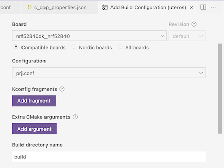
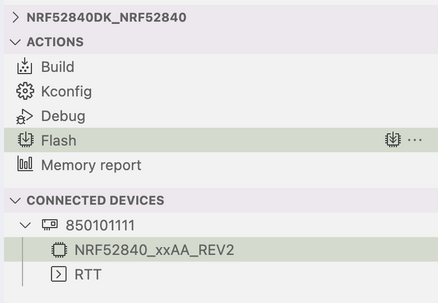

# `uteros`

**uteros** is a pressure biofeedback device for medical training.
The device can heat up and vibrate by BLE commands or pressure sensing.

This implementation supports BMP180 and BMP280 pressure sensor at the same time.

## Directory Structure

```text
  .             # - Root of your project
  |-- deps/     # - Third-party dependencies
  |-- src/      # - Main application source code
  |-- build/    # - Binaries after compiling and linking
```

## Prerequisites

- [nRF52840 DK](https://developer.nordicsemi.com/nRF_Connect_SDK/doc/v1.6-branch/zephyr/boards/arm/nrf52840dk_nrf52840/doc/index.html)
- [nRF Connect SDK v2.2.0](https://docs.nordicsemi.com/bundle/ncs-2.2.0/page/nrf/releases/release-notes-2.2.0.html)
- [nRF Connect for VS Code](https://marketplace.visualstudio.com/items?itemName=nordic-semiconductor.nrf-connect)

## Build & Flash

From the VS Code Plug-in, follow the settings below:



Then use default `Build` and `Flash` feature provided from the plug-in.



Or simply from the command line,

```bash
west build -p always -b nrf52840dk_nrf52840 ./src
west flash
```

Please refer to the [official nRF52840 DK document](https://developer.nordicsemi.com/nRF_Connect_SDK/doc/v1.6-branch/zephyr/boards/arm/nrf52840dk_nrf52840/doc/index.html#programming-and-debugging) for details.